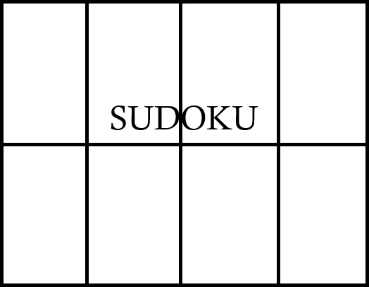

# Ứng dụng trò chơi Sudoku đơn giản




## 🎮 Giới thiệu

- **Sudoku** là một trò chơi giải đố logic kinh điển, được yêu thích rộng rãi nhờ luật chơi đơn giản và được phát triển - tối ưu trên nền tảng Android nhưng để chơi và phá đảo thì đòi hỏi phải sử dụng tư duy suy luận.

- Ứng dụng cho phép người chơi tham gia các màn chơi Sudoku ở các chế độ khác nhau (Easy/ Medium/ Hard/ Expert), rèn luyện khả năng tư duy logic và kiểm tra kỹ năng giải quyết vấn đề thông qua việc sắp xếp các chữ số theo đúng quy tắc của trò chơi.

      🟢 Easy	    🟡 Medium            🟠 Hard	    🔴 Expert

      🟢 Dễ	    🟡 Trung bình        🟠 Khó	    🔴 Chuyên gia

- Dự án được xây dựng nhằm mục đích học tập và thực hành phát triển ứng dụng Android, đồng thời làm quen với việc thiết kế giao diện và xây dựng logic xử lý cho một trò chơi Sudoku.

---

## ✨ Tính năng chính

### 1. 🎯 Hệ Thống Độ Khó

Ứng dụng cung cấp nhiều mức độ chơi, phù hợp với khả năng của từng người dùng:

🟢 Easy – Dành cho người mới bắt đầu.

🟡 Medium – Mức độ thử thách trung bình.

🟠 Hard – Yêu cầu khả năng suy luận tốt hơn.

🔴 Expert – Mức độ khó cao dành cho người chơi có kinh nghiệm.

Mỗi mức độ sẽ tạo ra một bảng Sudoku với độ khó tương ứng, giúp người chơi có thể lựa chọn thử thách phù hợp.

### 2. 🔢 Bảng Sudoku 9×9

Giao diện chính hiển thị bảng Sudoku tiêu chuẩn 9×9, bao gồm các ô đã được cung cấp sẵn và các ô trống để người chơi điền đáp án.

Người chơi có thể lựa chọn một ô và nhập các chữ số từ 1 đến 9. Các ô được hệ thống tạo sẵn sẽ không thể thay đổi.

### 3. ✅ Kiểm Tra Đáp Án

Hệ thống tự động kiểm tra các số người chơi nhập dựa trên luật Sudoku.

Hệ thống tự động trừ lượt có thể nhập sai hiện tại khi người dùng nhập sai đáp án. Điều này giúp người chơi nhận biết và điều chỉnh cách giải trong quá trình chơi.

Khi toàn bộ bảng được hoàn thành chính xác, hệ thống sẽ xác nhận và hiện thông báo người chơi đã hoàn thành ván Sudoku.

### 4. 💡 Công Cụ Hỗ Trợ

Để hỗ trợ người chơi trong quá trình giải, ứng dụng cung cấp các công cụ:

💡 Hint: Cung cấp gợi ý khi người chơi gặp khó khăn.

📝 Note: Cho phép người chơi túy ý ghi chú các số mà ngươi chơi cho rằng phù hợp với một ô đang được chọn.

↩️ Undo: Hoàn tác thao tác nhập số (kể cả số ghi nhập ở phần Note) trước đó.

⏱️ Timer: Theo dõi thời gian chơi, bắt đầu đếm từ khi người chơi chọn chế độ chơi, chơi lại đúng đề Sudoku hiện tại hoặc bắt đầu ván mới.

💾 Lưu tiến trình: Hệ thống tự động lưu lại toàn bộ trạng thái của ván chơi khi người chơi tắt ứng dụng hoặc quay về trang chủ, bao gồm thời gian đã chơi, các đáp án đã nhập, số lượt sai còn lại và số lượt gợi ý còn lại. Khi quay lại, người chơi có thể tiếp tục ván chơi từ trạng thái trước đó.

### 5. 🔄 Quản Lý Ván Chơi

Người chơi có thể quản lý và bắt đầu lại ván chơi thông qua các chức năng:

🔄 Chơi lại: Đưa bảng Sudoku hiện tại về trạng thái ban đầu.

🆕 Ván mới: Tạo một bảng Sudoku mới.

### 6. 🏆 Kết Quả & Thành Tích

Sau khi hoàn thành Sudoku, ứng dụng ghi nhận kết quả của người chơi dựa trên thời gian hoàn thành và mức độ khó.

Kết quả tốt nhất có thể được lưu lại với mục đích để người chơi theo dõi thành tích và cố gắng cải thiện kỷ lục của mình.

---

## 🛠️ Công Nghệ Sử Dụng

- **IDE / Ngôn ngữ:** Android Studio | Java (JDK 11)
  
- **Nền tảng:** Android
  
- **Quản lý Build:** Gradle Kotlin DSL (`build.gradle.kts`)
  
- **Android SDK:** API 37
  
- **Giao diện:** XML | `LinearLayout` | `ConstraintLayout` | `CardView` | `GridLayout` | `FrameLayout`
  
- **Lưu trữ dữ liệu:** `SharedPreferences`
  
## 📁 Cấu Trúc Thư Mục Dự Án (Cốt Lõi)

Dưới đây là sơ đồ tổ chức chứa các thư mục chính của ứng dụng Sudoku:

```text
📁 app/
└── 📁 src/
    └── 📁 main/
        ├── 📁 java/ntu/minhhoangg/duanketthucmonhoc/
        │   ├── 📁 data/
        │   │   ├── 📄 PuzzleRepository.java             # Quản lý và cung cấp các bộ đề cho ứng dụng
        │   │   └── 📄 ScoreManager.java                 # Quản lý và lưu trữ thành tích người chơi  
        │   ├── 📁 logic/
        │   │   └── 📄 SudokuValidator.java              # Kiểm tra tính hợp lệ của các đáp án Sudoku
        │   ├── 📁 model/
        │   │   ├── 📄 MoveHistory.java                  # Lưu lịch sử các thao tác để hỗ trợ Undo
        │   │   └── 📄 SudokuCell.java                   # Mô hình dữ liệu cho từng ô Sudoku
        │   ├── 📁 ui/
        │   │   ├── 📄 GameActivity.java                 # Màn hình chính của ván Sudoku
        │   │   └── 📄 HomeActivity.java                 # Màn hình trang chủ, lựa chọn và bắt đầu chế độ muốn chơi
        │   ├── 📁 util/
        │   │   └── 📄 TimerHelper.java                  # Hỗ trợ quản lý và tính thời gian chơi
        │   │       
        │   └── 📄 MainActivity.java                     # Màn hình khởi động của ứng dụng
        └── 📁 res/
            ├── 📁 drawable/                             # Hình ảnh và tài nguyên drawable của ứng dụng
            ├── 📁 layout/
                ├── 📄 activity_main.xml                 # Giao diện màn hình khởi động
                ├── 📄 activity_home.xml                 # Giao diện lựa chọn chế độ chơi
                └── 📄 activity_game.xml                 # Giao diện chính của ván Sudoku
